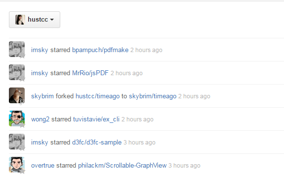

# GitHub-Helper.Chrome

Github: [https://github.com/aTool-org/GitHub-Helper.Chrome](https://github.com/aTool-org/GitHub-Helper.Chrome)

Chrome APP Store：[https://chrome.google.com/webstore/detail/GitHub Helper/bnpgnjajoaimdcjjmfjegpjmbmbplobm](https://chrome.google.com/webstore/detail/GitHub Helper/bnpgnjajoaimdcjjmfjegpjmbmbplobm)

## Has What ?

 - **Trending link**
 

 - **github file icon**
	

 - **github avatar**

## Other Modules

Waiting for your suggestions.

## Thanks for 

 - [https://github.com/chadluo/github-file-icon](https://github.com/chadluo/github-file-icon)
 - Github avatar（a chrome plugin）